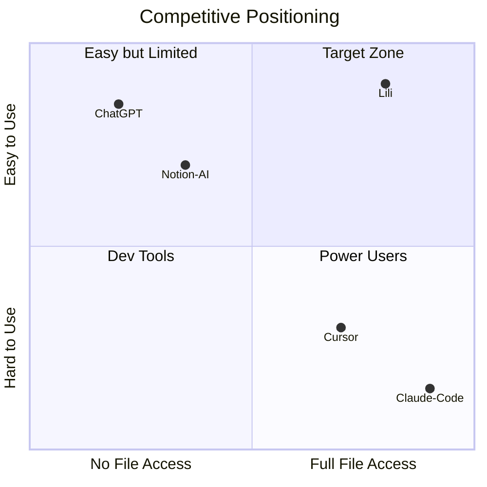

# lili project 브랜드 전략 v1.0

**작성일**: 2025-11-28
**버전**: v1.0
**목적**: 가칭 Lili Agent 통합 브랜드 전략 문서

---

## Part 0: 브랜딩을 위한 핵심가치 정의

### 우리가 해결하는 핵심 문제

> **"AI는 모두의 입에 오르내리지만, 정작 '진짜 업무'에 쓰려면 벽에 부딪힌다"**

| 문제 | 현실 |
|------|------|
| **파일 접근 불가** | "내 컴퓨터에 있는 엑셀 분석해줘" → 안 됨 |
| **맥락 망각** | "우리 회사 스타일대로 써줘" → 매번 복붙 |
| **연속성 없음** | "지난주 작업 이어서 해줘" → 기억 못함 |
| **진입장벽** | 강력한 도구(Claude Code)는 터미널 필요 |

### 제품의 본질적 가치

**"문제를 설명할 수 있는 사람이라면, 누구나 해결책을 만들 수 있어야 한다"**

가칭 lili 비개발자가 개발자처럼 AI를 활용할 수 있게 해주는 **AI 업무 파트너**입니다.

| 비개발자의 현실 | lili의 해결 |
|----------------|--------------|
| ChatGPT는 쉽지만 내 파일을 못 봄 | 로컬 파일 직접 접근 |
| Claude Code는 강력하지만 터미널 필요 | GUI로 쉽게 |
| AI가 우리 회사를 모름 | 맥락 기억, 팀 지식 축적 |
| 매번 처음부터 설명 | 프리셋으로 즉시 시작 |

### 핵심 차별점 3가지

```
1. 쉬움 (Ease)
   터미널 없이, 코딩 없이, 대화하듯 시작

2. 탁월함 (Excellence)
   웹의 정보와 내 파일을 통합적으로 이해하고 결과물을 도출

3. 협업 (Co-working)
   혼자 하지 마세요, 맡기세요
```

### 브랜드 Promise

> **"가칭 lili는 당신을 돕는 AI 업무 파트너입니다.
> 복잡한 건 AI스태프가, 중요한 결정은 당신이."**

---

## Part 1: Executive Summary

### 브랜드 한 줄 정의

> **가칭 lili 는 비개발자를 위한 AI 업무 파트너입니다.
> ChatGPT처럼 대화하면서, 내 작업과 웹의 정보를 통합적으로 연결해 탁월한 결과물을 만듭니다.**

### 핵심 타겟

| 순위 | 페르소나 | 비중 | 특징 |
|------|---------|------|------|
| 1순위 | 민지 (마케터) | 50% | 반복 업무 자동화 니즈 명확 |
| 2순위 | 준혁 (1인 창업가) | 30% | 개발자 없이 MVP 만들기 |
| 3순위 | 수진 (리서처) | 20% | 리서치 자동화, B2B 확장 |

### 핵심 가치 제안

**"ChatGPT의 쉬움 + Claude Code의 강력함"**

| 대상 | 가치 제안 |
|------|----------|
| 마케터 | 보고서, 콘텐츠 작성 시간 80% 절약 |
| 기획자 | 기획서, 요구사항 정리 자동화 |
| 리서처 | 웹 조사 → 보고서 원스톱 |
| 1인 창업가 | 개발자 없이 프로덕트 만들기 |

### 경쟁 포지셔닝 한 눈에



> **범례**: Lili = 목표 포지션 (쉬움 + 파일 접근)

| vs | 가칭 Lili의 차별점 |
|----|----------------|
| **ChatGPT** | 내 파일을 직접 본다 |
| **Claude Code** | 터미널 없이 쓴다 |
| **Cursor** | 비개발자도 쓴다 |
| **Notion AI** | 내 컴퓨터 전체를 본다 |

---

## Part 2: 브랜드 아이덴티티

### 2.1 네이밍 & 스토리

#### 이름의 탄생

**당신을 돕는 AI 스태프, 복잡한 건 AI 스태프가, 중요한 결정은 당신이 합니다. steffy.ai 스태피**


| 단계 | 이름 | 상태 |
|------|------|------|
| v1 | Lili Agent | 내부 사용 |
| v2.5 | Lilli (getlilli.ai) | 1순위 검토 |
| **v3.0** | **Steffy** | **최종 확정** |

#### 네이밍 스토리

```
Step by Step (단계별로 함께)
    ↓
Stepie (스테피) - step + ie
    ↓
Stephanie (스테파니) - 사람 이름 연상
    ↓
Steffy (스테피) - 친근한 애칭 형태
```

#### 의미 레이어링

| 층위 | 연상 | 브랜드 메시지 |
|------|------|--------------|
| 1차 | Step by step | 단계별로 차근차근 도와주는 AI |
| 2차 | Stephanie | 친근한 사람 이름, 의인화 |
| 3차 | Staff | 유능한 비서/조수 이미지 |

> **Note**: "Step by step" 의미는 네이밍에서 은유적으로 연상되도록 유지.
> 직접 슬로건화하지 않음.

#### 도메인 전략

```
1순위: steffy.ai
2순위: getsteffy.ai
3순위: heysteffy.ai
```

### 2.2 브랜드 에센스

#### Mission

> 비개발자도 AI와 진짜 일할 수 있는 세상을 만든다

#### Vision

> 코딩을 몰라도, 터미널을 몰라도,
> AI 스태프가 당신의 업무를 돕습니다.
> 아이디어를 생각하고, 결정만 하세요.

#### Core Values

| 가치 | 설명 |
|------|------|
| **접근성 (Accessibility)** | 누구나 쉽게 시작할 수 있어야 |
| **신뢰 (Trust)** | 맡기면 제대로 해내는 파트너 |
| **성장 (Growth)** | 사용할수록 더 똑똑해지는 AI |
| **협력 (Collaboration)** | 혼자가 아닌 함께 |

#### 태그라인

| 타입 | 태그라인 | 용도 |
|------|---------|------|
| **메인** | "당신의 첫 번째 AI 스태프" | 공식 슬로건 |
| 기능 | "AI 업무 파트너" | 제품 설명 |
| 행동 | "대화하듯, 일하듯" | 광고 카피 |
| 가치 | "반복은 맡기고, 창의에 집중하세요" | 마케팅 메시지 |
| 간결 | "말하면 됩니다" | 심플 카피 |

### 2.3 비주얼 아이덴티티 방향

#### 디자인 원칙

| 요소 | 방향 |
|------|------|
| **스타일** | 미니멀, 클린, 젠더 뉴트럴 |
| **컬러** | Primary Blue (#3182f6) 또는 네이비 |
| **타이포** | 모던 산세리프, 라운드 처리 |
| **아이콘** | 추상적 기하학 (S 또는 계단 모티프) |
| **느낌** | 전문적이면서 친근함 |

#### 로고 컨셉 방향

1. **워드마크**: "steffy" 커스텀 레터링
2. **심볼**: 계단/스텝 모티프 또는 추상적 S
3. **조합형**: 심볼 + 워드마크

---

## Part 3: 타겟 고객

### 3.1 페르소나 요약

#### Primary: 김민지 (마케터) - 50%

| 항목 | 내용 |
|------|------|
| **나이/직업** | 32세, 스타트업 마케팅 매니저 5년차 |
| **특징** | ChatGPT Pro 사용 중, 반복 업무에 시간 소모 |
| **Pain Point** | 주간 보고서 3시간, AI가 파일을 못 봄 |
| **Steffy 활용** | 보고서 자동화, 콘텐츠 작성, 인턴 피드백 |

#### Secondary: 이준혁 (1인 창업가) - 30%

| 항목 | 내용 |
|------|------|
| **나이/직업** | 28세, 프리랜서 PM / 창업 준비 |
| **특징** | 아이디어는 많지만 개발 못함, 노코드 경험 |
| **Pain Point** | Claude Code 시도했지만 터미널에서 좌절 |
| **Steffy 활용** | IR 피치덱, 고객 인터뷰 정리, 바이브 코딩 |

#### Tertiary: 박수진 (리서처) - 20%

| 항목 | 내용 |
|------|------|
| **나이/직업** | 38세, 컨설팅펌 시니어 컨설턴트 |
| **특징** | 리서치 품질에 엄격, 팀 리드 |
| **Pain Point** | 급한 리서치 요청, 팀 지식 전수 어려움 |
| **Steffy 활용** | 시장 조사 자동화, 팀 리서치 가이드 적용 |

> **상세 페르소나**: [steffy-brand-persona-story-v2.md](./steffy-brand-persona-story-v2.md) 참조

### 3.2 핵심 Pain Point

| Pain Point | 설명 | 영향 페르소나 |
|------------|------|--------------|
| **반복 업무 시간 낭비** | 보고서, 데이터 정리에 매주 수 시간 | 민지, 수진 |
| **"거의 다 왔는데" 좌절** | ChatGPT가 파일/맥락을 못 봄 | 민지, 준혁 |
| **개발자 도구 진입장벽** | 터미널, npm, 에러 메시지 | 준혁, 민지 |
| **팀 지식 전수 어려움** | 온보딩, 품질 기준 반복 설명 | 민지, 수진 |
| **혼자 모든 걸 해야 함** | 1인 창업의 멀티태스킹 | 준혁 |

### 3.3 Job to be Done

#### 기능적 (Functional)

- 반복 업무 자동화 (보고서, 데이터 정리)
- 파일 분석 및 인사이트 도출
- 콘텐츠 작성 (브랜드 가이드 준수)
- 리서치 및 출처 관리

#### 감정적 (Emotional)

- 유능하다는 느낌 ("나도 AI 잘 쓴다")
- 불안 해소 ("제때 끝낼 수 있을까")
- 자신감 ("개발자 없이도 된다")

#### 사회적 (Social)

- 팀에서 인정받기
- 트렌드에 뒤처지지 않기
- 전문가로 보이기

---

## Part 4: 제품 포지셔닝

### 4.1 핵심 가치 제안

#### 공식

> **"ChatGPT의 쉬움 + Claude Code의 강력함"**

#### 3가지 핵심 가치

| 가치 | 설명 | 경쟁 대비 |
|------|------|----------|
| **로컬 파일 접근** | 내 컴퓨터 파일 직접 읽고 수정 | ChatGPT, Notion AI 불가 |
| **Zero Setup** | 터미널 없이, 코딩 없이 시작 | Claude Code 대비 |
| **맥락 기억** | 팀 지식, 브랜드 가이드 축적 | 모든 경쟁 제품 대비 |

### 4.2 경쟁 포지셔닝 맵

| 경쟁사 | 접근성 | 파일 접근 | Steffy 차별점 |
|--------|--------|----------|---------------|
| **ChatGPT** | ⭐⭐⭐⭐⭐ | ❌ | 파일 직접 접근 |
| **Claude Code** | ⭐ | ⭐⭐⭐⭐⭐ | 터미널 불필요 |
| **Cursor** | ⭐⭐ | ⭐⭐⭐⭐ | 비개발자 타겟 |
| **Notion AI** | ⭐⭐⭐⭐ | ⭐⭐ (노션 내) | 컴퓨터 전체 접근 |
| **Genspark** | ⭐⭐⭐⭐ | ⭐⭐ (클라우드) | 로컬 파일 + 커스터마이징 |

### 4.3 차별화 전략

#### MVP 핵심 기능 (개인용 5가지)

| 기능 | 설명 | 성공 지표 |
|------|------|----------|
| **원클릭 환경 설치** | Node.js, Claude Code CLI 자동 설치 | 설치 완료율 90%+ |
| **채팅 UI** | 메시지 버블, 마크다운 렌더링 | 첫 작업 완료 5분 이내 |
| **파일/폴더 접근** | 로컬 파일 시스템 전체 | 핵심 차별점 |
| **기본 프리셋 3개** | 마케팅/리서치/문서 작성 | 즉시 시작 가능 |
| **자동 업데이트** | 백그라운드 업데이트 | 사용자 경험 |

#### Lock-in 전략

| 전략 | 설명 | 효과 |
|------|------|------|
| **맥락 중심 협업** | 작업 맥락 공유, 팀 프리셋, 프롬프트 라이브러리 | 노하우 축적 |
| **지식 중심 협업** | 팀 메모리, 대화 히스토리 검색 | 시간이 갈수록 가치 증가 |

---

## Part 5: 브랜드 커뮤니케이션

### 5.1 브랜드 보이스 & 톤

#### Steffy의 성격

| 특성 | 설명 | 예시 |
|------|------|------|
| **친근함** | 동료처럼 편하게 | "이거 금방 끝날 거예요!" |
| **신뢰감** | 유능한 비서처럼 | "제가 정리해둘게요, 확인만 해주세요." |
| **차분함** | 급하지 않게 | "천천히 설명해주세요, 다 들을게요." |
| **긍정적** | 할 수 있다는 느낌 | "어렵지 않아요, 같이 해봐요!" |

#### DO / DON'T

**DO:**
- "~해드릴까요?" (제안형)
- "~정리해봤어요" (완료형)
- "어떤 것부터 시작할까요?" (선택권 부여)
- "제가 도와드릴게요" (협력적)

**DON'T:**
- "~하세요" (명령형)
- "~해야 합니다" (강제적)
- "~못합니다" (부정적)
- "~모르겠습니다" (무책임)

### 5.2 메시징 프레임워크

#### 핵심 메시지 3가지

| # | 메시지 | 강조점 |
|---|--------|--------|
| 1 | "터미널 없이, 코딩 없이, 대화하듯 시작하세요" | 쉬움 |
| 2 | "ChatGPT가 못하는 것 — 내 파일 직접 접근" | 강력함 |
| 3 | "혼자 하지 마세요, Steffy에게 맡기세요" | 함께함 |

#### 페르소나별 메시지 변형

| 페르소나 | 맞춤 메시지 |
|---------|------------|
| **민지 (마케터)** | "주간 보고서 3시간 → 15분. 이제 Steffy에게 맡기세요." |
| **준혁 (창업가)** | "개발자 없이 MVP 만들기. 드디어 가능해졌습니다." |
| **수진 (리서처)** | "리서치 시간 절반으로, 인사이트에 집중하세요." |

### 5.3 마케팅 카피 라이브러리

#### 헤드라인

- "코딩 없이, AI와 진짜 일하기"
- "ChatGPT가 내 파일을 볼 수 있다면?"
- "터미널 몰라도 괜찮아요"
- "당신의 첫 번째 AI 스태프, Steffy"

#### 서브헤드

- "대화하듯, 일하듯"
- "반복 업무는 Steffy에게, 창의적인 일은 당신에게"
- "말하면 됩니다"

#### CTA

- "Steffy 시작하기"
- "무료로 만나보기"
- "지금 다운로드"

#### 소셜 미디어 템플릿

**인스타그램:**
```
[보고서 작성 3시간 → 15분]

월요일마다 반복되는 주간 보고서,
이제 Steffy에게 맡기세요.

"스테피, 이 폴더에 있는 데이터로
지난주 성과 보고서 만들어줘"

끝.

#AI비서 #업무자동화 #Steffy
```

**링크드인:**
```
"비개발자도 AI 에이전트를 쓸 수 있어야 합니다."

Claude Code는 강력하지만, 터미널이 필요합니다.
ChatGPT는 쉽지만, 내 파일을 볼 수 없습니다.

Steffy는 둘의 장점을 합쳤습니다.
- ChatGPT처럼 쉬운 대화형 UI
- Claude Code처럼 강력한 파일 접근

마케터, 기획자, 리서처를 위한 AI 업무 파트너.
당신의 첫 번째 AI 스태프, Steffy.
```

---

## Part 6: 부록

### 관련 문서

| 문서 | 내용 | 버전 |
|------|------|------|
| [steffy-naming-strategy-v3.md](./steffy-naming-strategy-v3.md) | 네이밍 전략, 도메인, 경쟁사 네이밍 비교 | v3.0 |
| [steffy-brand-persona-story-v2.md](./steffy-brand-persona-story-v2.md) | 상세 페르소나 3종, 브랜드 스토리, 보이스&톤 | v2.0 |
| [lili-agent-mvp-중간정리-v0.2.md](./lili-agent-mvp-중간정리-v0.2.md) | 제품 정의, 시장 검증, MVP 기능, 협업 전략 | v0.2 |

### 브랜드 핵심 요약

```
브랜드명: Steffy (스테피)
태그라인: 당신의 첫 번째 AI 스태프

핵심 가치 제안:
ChatGPT의 쉬움 + Claude Code의 강력함

타겟:
비개발자 (마케터, 기획자, 리서처, 1인 창업가)

핵심 차별점:
1. 로컬 파일 접근
2. Zero Setup
3. 맥락 기억 + 팀 지식 축적

브랜드 톤:
친근, 신뢰, 차분, 긍정

네이밍의 은유:
Steffy ← Stephanie ← Stepie ← "Step by step"
(직접 언급하지 않고, 이름에서 자연스럽게 연상되도록)
```

---

**문서 정보**:
- 작성일: 2025-11-28
- 버전: v1.0
- 작성자: steve@popupstudio.ai
- 소스 문서: steffy-naming-strategy-v3.md, steffy-brand-persona-story-v2.md, lili-agent-mvp-중간정리-v0.2.md
