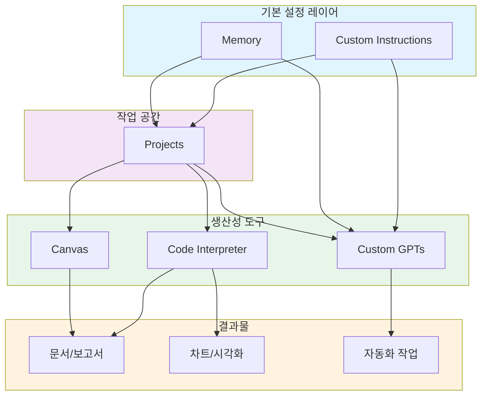
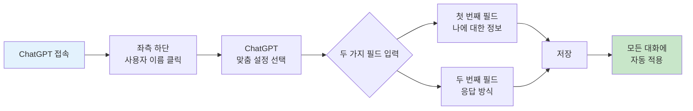
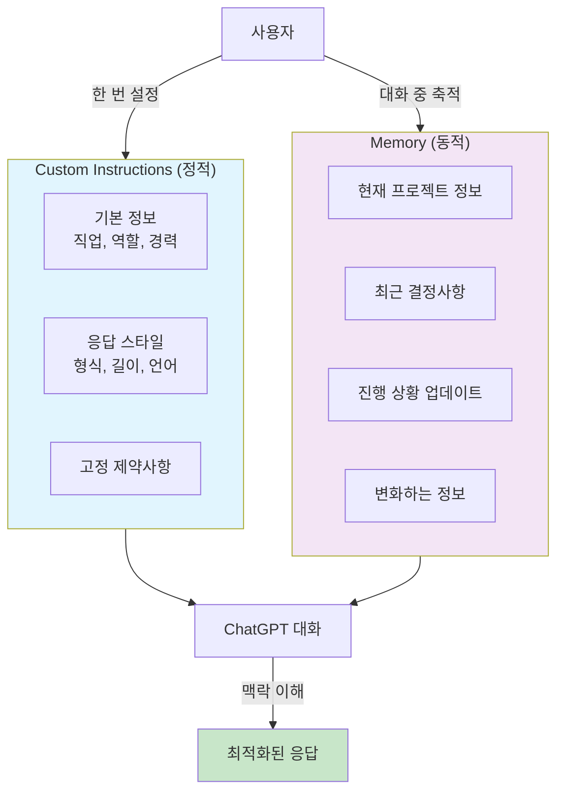
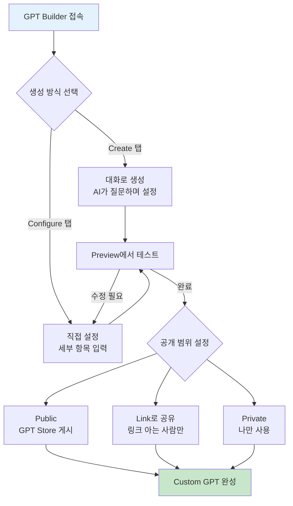
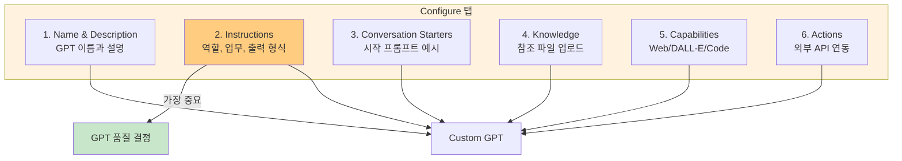
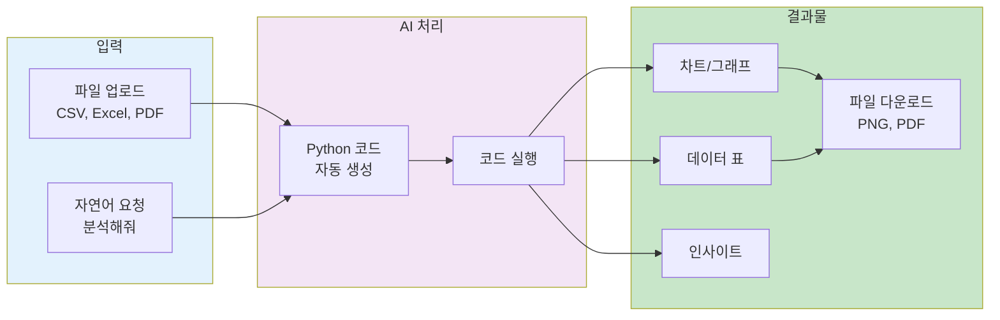
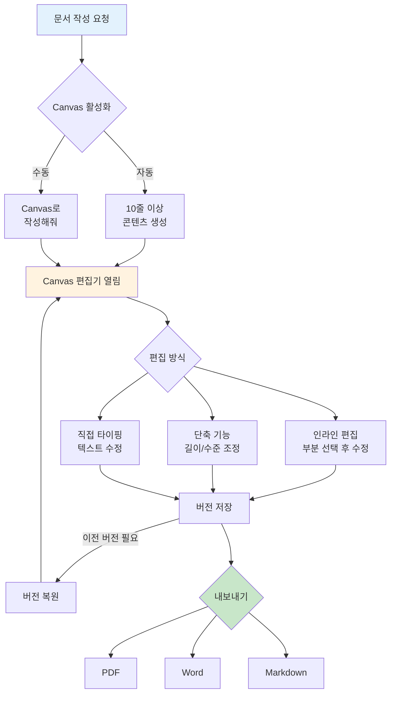
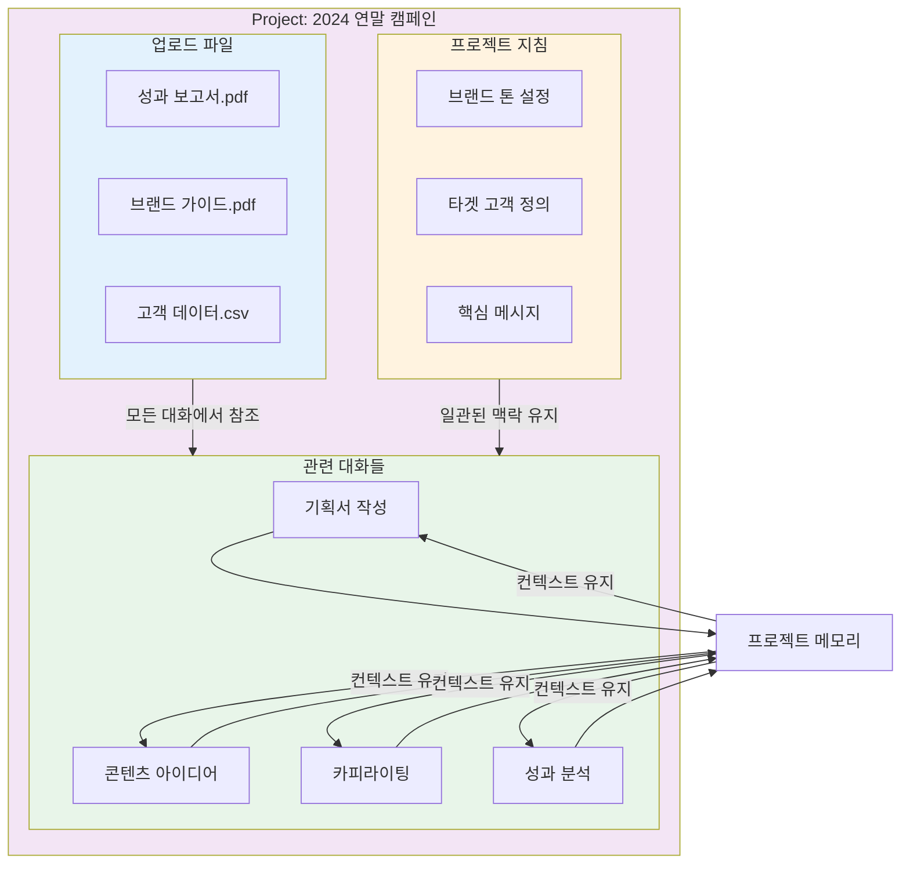
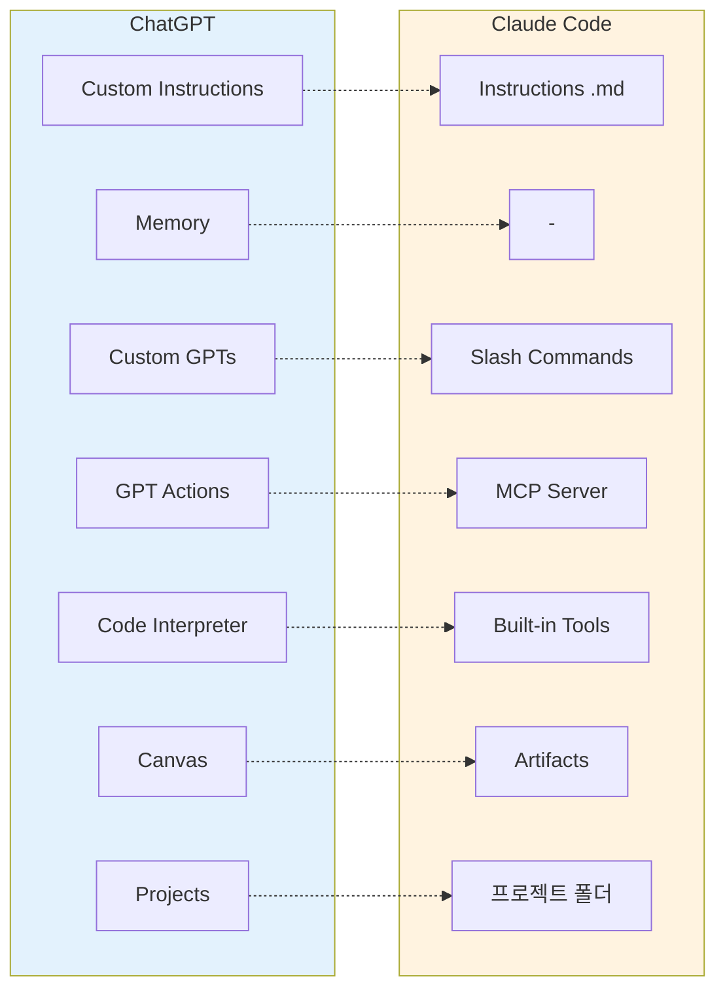
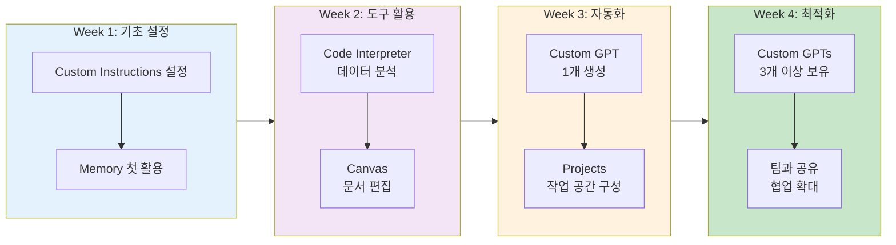

# ChatGPT 고급 기능 완전 정복

비개발자도 이해하고 바로 활용할 수 있는 ChatGPT의 핵심 기능들을 설명합니다.

---

## 목차
1. [왜 이 기능들을 알아야 하나?](#왜-이-기능들을-알아야-하나)
2. [Custom Instructions - AI에게 나를 기억시키기](#1-custom-instructions---ai에게-나를-기억시키기)
3. [Memory - 대화를 통한 기억 축적](#2-memory---대화를-통한-기억-축적)
4. [Custom GPTs - 나만의 AI 비서 만들기](#3-custom-gpts---나만의-ai-비서-만들기)
5. [Code Interpreter - 코딩 없이 데이터 분석](#4-code-interpreter---코딩-없이-데이터-분석)
6. [Canvas - 문서 협업 편집기](#5-canvas---문서-협업-편집기)
7. [Projects - 프로젝트별 작업 공간](#6-projects---프로젝트별-작업-공간)
8. [Claude Code와 비교](#7-claude-code와-비교)
9. [시작하기 체크리스트](#8-시작하기-체크리스트)

---

## 왜 이 기능들을 알아야 하나?

### 일반적인 ChatGPT 사용의 한계

```
매번 같은 설명을 반복해야 함
"저는 마케팅 담당자이고, 보고서는 이런 형식으로..."
"아까 말한 그 프로젝트인데..."
새 대화마다 컨텍스트가 리셋됨
```

### 고급 기능을 활용하면

```
한 번 설정하면 모든 대화에 자동 적용
프로젝트별로 맥락 유지
반복 작업을 자동화
전문적인 분석도 코딩 없이 가능
```

### 기능별 핵심 효과

| 기능 | 비유 | 효과 |
|------|------|------|
| Custom Instructions | AI에게 주는 업무 매뉴얼 | 매번 설명 안 해도 됨 |
| Memory | 업무 일지 자동 작성 | 대화 내용이 누적됨 |
| Custom GPTs | 맞춤 제작 AI 비서 | 특정 업무에 최적화 |
| Code Interpreter | 자동 데이터 분석가 | 코딩 없이 분석/차트 |
| Canvas | 구글 독스 + AI | 문서 직접 편집 |
| Projects | 프로젝트 폴더 | 관련 작업 한 곳에 |

### ChatGPT 고급 기능 관계도

아래 다이어그램은 ChatGPT 고급 기능들이 어떻게 상호 연결되어 작동하는지 보여줍니다.



---

## 1. Custom Instructions - AI에게 나를 기억시키기

### 이게 뭔가요?

**Custom Instructions**는 ChatGPT가 모든 대화에서 자동으로 참고하는 **사용자 지정 설정**입니다. 한 번 설정하면 새 대화마다 자동 적용됩니다.

### 설정 위치

1. ChatGPT 좌측 하단 **사용자 이름** 클릭
2. **"ChatGPT 맞춤 설정"** 선택
3. 두 개의 텍스트 박스에 내용 입력
4. **저장** 클릭

**단축키**: `Ctrl + Shift + I`

### Custom Instructions 설정 흐름

아래 다이어그램은 Custom Instructions를 설정하는 사용자 여정을 보여줍니다.



### 두 가지 입력 필드

| 필드 | 질문 | 내용 |
|------|------|------|
| **첫 번째** | "ChatGPT가 당신에 대해 알았으면 하는 것은?" | 나에 대한 정보 (직업, 업무, 상황) |
| **두 번째** | "ChatGPT가 어떻게 응답하길 원하나요?" | 응답 방식 (형식, 톤, 길이) |

### 효과적인 작성 예시

#### 마케팅 담당자용

**첫 번째 필드 (나에 대한 정보):**
```
저는 국내 중견기업의 마케팅팀 대리입니다.
주요 업무: SNS 콘텐츠 기획, 광고 캠페인 운영, 성과 분석
사용 도구: Meta 광고 관리자, Google Analytics, Canva
타겟 고객: 25-45세 직장인 여성
현재 과제: 제한된 예산으로 신제품 인지도 높이기
경력: 마케팅 3년차
```

**두 번째 필드 (응답 방식):**
```
- 간결하고 실행 가능한 답변을 주세요
- 복잡한 개념은 쉬운 예시와 함께 설명해주세요
- 가능하면 표나 불릿 포인트로 정리해주세요
- 구체적인 수치나 벤치마크가 있으면 포함해주세요
- 답변 마지막에 바로 실행할 수 있는 액션 아이템을 제안해주세요
```

#### 기획자용

**첫 번째 필드:**
```
역할: IT 서비스 기획자 (5년차)
소속: 모바일 앱 개발 회사 기획팀
담당 업무:
- 신규 서비스/기능 기획
- 사용자 요구사항 분석 및 정의
- 화면 설계서 작성
- 개발팀, 디자인팀과의 협업

주요 고객: 20-30대 일반 소비자
사용 도구: Figma, Notion, Jira, Miro
```

**두 번째 필드:**
```
- 구조화된 형식으로 정리 (개요 → 세부사항 → 결론)
- 기능 제안 시 사용자 스토리 형식 포함
- UX 관점의 인사이트 포함
- 실제 서비스 사례와 벤치마크 제시
- 답변 후 "추가로 고려할 사항" 제안
```

### 한계점

| 제한사항 | 설명 |
|---------|------|
| 글자 수 | 각 필드당 1,500자 |
| GPTs 미적용 | Custom GPTs 사용 시 적용 안 됨 |
| 다중 프로필 없음 | 여러 세트 저장/전환 불가 |

---

## 2. Memory - 대화를 통한 기억 축적

### 이게 뭔가요?

**Memory**는 ChatGPT가 대화 중 언급된 정보를 기억하여 이후 대화에서 활용하는 기능입니다.

### Custom Instructions vs Memory 차이

| 구분 | Custom Instructions | Memory |
|------|---------------------|--------|
| 입력 방식 | 직접 작성 | 대화 중 축적 |
| 성격 | 정적 (변하지 않는 정보) | 동적 (시간에 따라 변화) |
| 예시 | "나는 마케터다" | "현재 A 프로젝트 3주차" |

### 기억 저장 방법

#### 수동 저장 (명시적 요청)
```
"이것을 기억해줘: 나는 매주 월요일에 팀 미팅이 있어"
"내가 채식주의자라는 걸 기억해줘"
"현재 신제품 런칭 캠페인 준비 중이라는 걸 기억해줘"
"우리 팀 예산이 월 500만원이라는 걸 기억해줘"
```

#### 자동 저장
- ChatGPT가 유용할 것 같은 정보를 자동으로 감지하여 저장
- "저는 채식주의자예요" → 이후 레시피 추천 시 자동 반영

### 기억 관리

#### 확인하기
```
"나에 대해 무엇을 기억하고 있니?"
"지금까지 나에 대해 기억한 것들을 알려줘"
```

또는: **설정 > 개인 맞춤 설정 > 메모리 관리**

#### 삭제하기
```
"내 예산에 대한 기억을 삭제해줘"
"이 내용은 잊어버려"
```

또는: 설정에서 개별/전체 삭제

### 임시 채팅

메모리를 사용하지 않고 대화하고 싶을 때:
- ChatGPT 메인 화면에서 **임시 채팅** 선택
- 민감한 정보나 일회성 질문에 적합

### 활용 전략

```
Custom Instructions에 설정:
├── 기본 정보 (직업, 역할, 경력)
├── 응답 스타일 (형식, 길이, 언어)
└── 고정된 제약사항

Memory에 저장:
├── 현재 프로젝트 정보
├── 최근 결정사항
├── 진행 상황 업데이트
└── 변화하는 정보
```

### Custom Instructions와 Memory 활용 전략도

아래 다이어그램은 Custom Instructions와 Memory를 언제, 어떻게 활용하는지 보여줍니다.



---

## 3. Custom GPTs - 나만의 AI 비서 만들기

### 이게 뭔가요?

**Custom GPTs**는 특정 목적에 맞게 ChatGPT를 커스터마이징한 AI 챗봇입니다. 코딩 없이 대화만으로 만들 수 있습니다.

### Claude Code와 비교

| Custom GPTs | Claude Code 유사 기능 |
|------------|---------------------|
| Instructions | Slash Commands |
| Knowledge (파일 업로드) | 프로젝트 컨텍스트 |
| Actions (API 연동) | MCP 서버 |
| Capabilities | Built-in Tools |

### 요금제별 차이

| 구분 | 무료 | Plus ($20/월) |
|-----|------|--------------|
| GPT 생성 | 불가 | 가능 |
| GPT Store 접근 | 사용만 | 완전 접근 |
| Knowledge 업로드 | 불가 | 가능 (20개 파일) |

### GPT Builder 접근 방법

1. **https://chatgpt.com/create** 접속
2. 또는: 좌측 사이드바 "Explore GPTs" > "Create"

### Custom GPT 생성 프로세스

아래 다이어그램은 Custom GPT를 생성하는 전체 과정을 보여줍니다.



### Configure 탭 설정 항목

#### 1. Name & Description
```
Name: 마케팅 분석 전문가
Description: 마케팅 데이터를 분석하고 인사이트를 도출하는 전문 AI
```

#### 2. Instructions (가장 중요!)

**구조화된 작성법:**
```
## 역할
당신은 10년 경력의 디지털 마케팅 분석 전문가입니다.

## 핵심 업무
- 마케팅 KPI 분석 (CTR, CPA, ROAS, LTV 등)
- 채널별 성과 비교 분석
- 경쟁사 벤치마킹
- 데이터 기반 전략 제안

## 출력 형식
- 핵심 발견사항: bullet point (최대 5개)
- 데이터: 표 형식
- 시각화: 차트 생성 권장
- 제안: 구체적인 액션 아이템

## 제한 사항
- 데이터 없이 추측하지 않음
- 불확실한 정보는 명시
```

#### 3. Conversation Starters
```
- "이번 달 페이스북 광고 성과를 분석해줘"
- "CTR을 개선할 수 있는 방법을 제안해줘"
- "채널별 ROAS를 비교 분석해줘"
- "A/B 테스트 결과를 해석해줘"
```

#### 4. Knowledge (파일 업로드)
- 회사 브랜드 가이드라인 PDF
- 제품 정보 문서
- 과거 보고서
- 용어 정의집

**제한**: GPT당 20개 파일, 각 512MB

#### 5. Capabilities (기능)

| 기능 | 설명 |
|-----|------|
| Web Browsing | 실시간 웹 검색 |
| DALL-E | 이미지 생성 |
| Code Interpreter | 데이터 분석, 차트 생성 |

#### 6. Actions (API 연동)

Zapier를 활용하면 코딩 없이 설정 가능:
- Gmail: 이메일 발송
- Google Calendar: 일정 등록
- Slack: 팀 알림

### GPT Builder Configure 구조

아래 다이어그램은 Configure 탭의 6가지 설정 항목과 그 관계를 보여줍니다.



### 실전 GPT 예시

#### 주간 보고서 작성 GPT

```
Name: 주간보고서 작성 도우미

Instructions:
## 보고서 구조
1. 개요 (3줄 이내)
2. 금주 완료 업무
   - 업무명 | 담당자 | 완료일 | 성과
3. 진행 중 업무
   - 업무명 | 진행률 | 예상 완료일 | 이슈
4. 차주 계획
5. 특이사항/건의사항

## 작성 스타일
- 객관적이고 간결한 문체
- 수치와 사실 중심
- 표 형식 활용

Conversation Starters:
- "이번 주 업무 내용으로 보고서 작성해줘"
- "보고서 양식을 알려줘"
```

#### 회의록 정리 GPT

```
Name: 회의록 정리 도우미

Instructions:
## 회의록 형식
1. 회의 정보 (회의명, 일시, 참석자)
2. 회의 목적
3. 주요 논의 사항
4. 결정 사항
5. Action Items
   | 담당자 | 할 일 | 마감일 |
6. 다음 미팅 일정

## 입력 방식
- 텍스트로 된 회의 대화 내용
- 음성 인식 텍스트
- 메모 형태의 노트
```

### GPT Store

- 2024년 1월 출시
- 300만 개 이상의 Custom GPT 등록
- 유용한 기존 GPT 활용 가능:
  - **Consensus**: 학술 논문 검색
  - **Canva**: 디자인 작업
  - **Data Analyst**: 데이터 분석

---

## 4. Code Interpreter - 코딩 없이 데이터 분석

### 이게 뭔가요?

**Code Interpreter**(현재 명칭: Advanced Data Analysis)는 ChatGPT가 Python 코드를 실행하여 데이터 분석, 차트 생성 등을 수행하는 기능입니다.

**핵심**: 사용자가 코드를 몰라도 자연어로 요청하면 AI가 알아서 코드를 작성하고 실행합니다.

### Code Interpreter 워크플로우

아래 다이어그램은 Code Interpreter를 사용한 데이터 분석 과정을 보여줍니다.



### 활성화 방법

**현재는 자동 활성화!**
- ChatGPT Plus 사용자는 파일을 업로드하면 자동으로 활성화
- 별도 설정 불필요

### 지원 파일 형식

| 카테고리 | 파일 형식 |
|----------|-----------|
| 스프레드시트 | CSV, XLS, XLSX |
| 문서 | PDF, DOCX, TXT |
| 이미지 | JPEG, PNG, GIF |
| 데이터 | JSON, XML |

**파일 크기 제한**: 512MB

### 비개발자를 위한 활용법

#### Excel/CSV 데이터 분석

**할 수 있는 것:**
- 데이터 요약 및 통계 계산
- 월별/분기별 트렌드 분석
- 카테고리별 비교
- 이상치 탐지

#### 차트 및 시각화

**생성 가능한 차트:**
- 막대 그래프, 선 그래프, 원형 그래프
- 산점도, 히스토그램, 히트맵

**장점**: 차트를 PNG로 다운로드하여 보고서에 바로 활용

#### 파일 변환

- Excel → CSV
- JSON → CSV
- 이미지 형식 변환

### 실전 프롬프트 예시

#### 판매 데이터 분석
```
이 Excel 파일을 분석해줘. 지난 12개월 판매 데이터야.

다음을 분석해줘:
1. 데이터 개요 (행/열 수, 결측치)
2. 월별 매출 트렌드를 선 그래프로
3. 상위 5개 제품과 성장률
4. 지역별 판매 분포를 원형 그래프로
5. 특이점이나 계절성 파악

표와 차트로 정리해줘.
```

#### 설문 결과 분석
```
이 설문 결과 CSV 파일을 분석해줘.

1. 응답자 기본 정보 요약 (연령대, 성별 분포)
2. 각 질문별 응답 분포를 막대 그래프로
3. 만족도 점수의 평균과 표준편차
4. 연령대별 만족도 차이 분석
5. 주요 인사이트 3가지 요약
```

#### 자동 보고서 생성
```
이 데이터로 주간 보고서를 자동 생성해줘.

포함할 내용:
1. Executive Summary (3줄 요약)
2. 주요 KPI 현황 (표)
3. 주간 트렌드 차트
4. 주목할 만한 변화점
5. 다음 주 액션 아이템

보고서를 PDF로 만들어줘.
```

### 한계점

| 제한사항 | 설명 |
|---------|------|
| 인터넷 접근 불가 | 실시간 데이터 조회 불가 |
| 한국어 OCR 미지원 | 이미지 내 한글 인식 부정확 |
| 대용량 데이터 | 매우 큰 파일은 처리 시간 초과 가능 |

### 보안 주의사항

- 민감한 개인정보 포함된 파일 업로드 주의
- 회사 기밀 데이터는 IT/보안 부서에 사용 가능 여부 문의
- 가능하면 개인 식별 정보 제거 후 업로드

---

## 5. Canvas - 문서 협업 편집기

### 이게 뭔가요?

**Canvas**는 ChatGPT의 문서/코드 전용 **협업 편집 인터페이스**입니다. 일반 채팅과 달리 직접 편집이 가능합니다.

### 일반 채팅 vs Canvas

| 구분 | 일반 채팅 | Canvas |
|------|-----------|--------|
| 편집 방식 | 새 대화로 이어가기 | 직접 텍스트 선택하여 편집 |
| 결과물 관리 | 대화 내 흩어짐 | 하나의 문서로 통합 |
| 버전 관리 | 없음 | 이전 버전 복원 가능 |
| 내보내기 | 복사/붙여넣기 | PDF, Word, Markdown 직접 내보내기 |

### 활성화 방법

1. **자동**: 10줄 이상 콘텐츠 생성 시 자동 활성화
2. **수동**: "Canvas를 사용해서 작성해줘" 프롬프트에 포함
3. **메뉴**: View tools > Canvas 선택

### Canvas 편집 프로세스

아래 다이어그램은 Canvas를 활용한 문서 작성 및 편집 과정을 보여줍니다.



### 주요 기능

#### 글쓰기 단축 기능

| 기능 | 설명 |
|------|------|
| **Suggest edits** | 인라인 수정 제안 |
| **Adjust length** | 문서 길이 조절 (짧게/길게) |
| **Change reading level** | 독해 수준 조정 (유치원~대학원) |
| **Add final polish** | 문법, 명확성, 일관성 최종 검토 |
| **Add emojis** | 이모지 추가 |

#### 인라인 편집

1. 수정할 부분 드래그 선택
2. 원하는 수정 요청
   - "이 단락을 줄여줘"
   - "더 전문적인 톤으로 바꿔줘"
   - 직접 텍스트 수정도 가능

#### 버전 관리

- 상단 뒤로가기 버튼으로 이전 버전 복원
- "Show changes"로 버전 간 차이점 확인

#### 내보내기

- PDF, Word (.docx), Markdown (.md)
- 코드 파일 (.py, .js 등)
- 클립보드 복사, 링크 공유

### 실전 워크플로우: 마케팅 기획서 작성

**Step 1: 초안 생성 (5분)**
```
"2024년 연말 프로모션 마케팅 기획서를 Canvas로 작성해줘.
목표: 매출 20% 증가 / 예산: 5천만원 / 기간: 11-12월
구조: 개요, 시장분석, 타겟, 전략, 예산배분, 일정, KPI"
```

**Step 2: 섹션별 상세화 (10분)**
- "시장분석" 선택 → "경쟁사 분석 추가해줘"
- "예산배분" 선택 → "표로 정리해줘"

**Step 3: 톤 조정 (5분)**
- "Change reading level" → High School (경영진용)
- 전문 용어 부분 선택 → "쉽게 설명해줘"

**Step 4: 최종 검토 (5분)**
- "Add final polish" 클릭
- "Suggest edits"로 개선점 확인

**Step 5: 내보내기**
- Word로 다운로드

---

## 6. Projects - 프로젝트별 작업 공간

### 이게 뭔가요?

**Projects**는 관련된 대화, 파일, 지침을 한 곳에서 관리하는 **스마트 워크스페이스**입니다.

### Projects 구조

아래 다이어그램은 Projects의 구성 요소와 작동 방식을 보여줍니다.



### 주요 기능

#### 1. 대화 그룹화
- 관련 대화들을 하나의 프로젝트로 묶기
- 기존 대화를 프로젝트로 이동 가능

#### 2. 파일 업로드
- 프로젝트에 파일 업로드 -> 프로젝트 내 모든 대화에서 참조 가능
- 지원: PDF, DOCX, XLSX, 이미지 등 (최대 500MB)

#### 3. Custom Instructions 연동
```
프로젝트별 지침 설정:
"이 프로젝트에서는:
- 항상 공식적인 비즈니스 톤 사용
- 한국어로 응답
- Canvas를 기본으로 열기
- 마케팅 전문 용어 사용"
```

#### 4. 프로젝트 메모리
- 해당 프로젝트 내 대화에서만 컨텍스트 유지
- 다른 프로젝트와 분리

### 프로젝트 생성 방법

1. 사이드바에서 "Projects" 찾기
2. + 아이콘 클릭
3. 프로젝트 이름 입력
4. 파일 업로드 및 지침 설정

### 실전 활용: 캠페인 프로젝트

**프로젝트명**: "2024 연말 캠페인"

**포함 대화:**
- 기획서 작성
- 콘텐츠 아이디어 브레인스토밍
- 카피라이팅
- 성과 분석

**업로드 파일:**
- 지난해 캠페인 성과 보고서.pdf
- 브랜드 가이드라인.pdf
- 타겟 고객 데이터.csv

**Custom Instructions:**
```
"우리 브랜드 톤: 친근하지만 전문적
타겟: 25-35세 직장인
핵심 메시지: '스마트한 연말 선물'"
```

**효과:**
- 새 대화 시작해도 프로젝트 맥락 유지
- 일관된 톤과 메시지
- 매번 같은 설명 반복 불필요

---

## 7. Claude Code와 비교

### 기능 매핑

| ChatGPT | Claude Code | 설명 |
|---------|-------------|------|
| Custom Instructions | Instructions (.md) | 기본 지침 설정 |
| Memory | - | 대화 기억 (Claude는 없음) |
| Custom GPTs | Slash Commands | 반복 작업 자동화 |
| GPT Actions | MCP Server | 외부 API 연동 |
| Code Interpreter | Built-in Tools | 데이터 분석 |
| Canvas | - | 문서 편집 (Claude는 Artifacts) |
| Projects | 프로젝트 폴더 | 작업 공간 관리 |

### ChatGPT와 Claude Code 기능 비교도

아래 다이어그램은 두 도구의 기능 매핑 관계를 시각적으로 보여줍니다.



### 주요 차이점

#### ChatGPT 강점
- **GUI 기반**: 비개발자도 쉽게 설정
- **GPT Store**: 타인이 만든 GPT 활용 가능
- **Memory**: 대화 내용 자동 기억
- **Canvas**: 직접 문서 편집 가능
- **추가 기능**: 이미지 생성(DALL-E), 음성 입출력

#### Claude Code 강점
- **터미널 통합**: 개발 환경과 직접 연동
- **파일 시스템 접근**: 로컬 파일 직접 읽기/쓰기
- **코드 실행**: 더 강력한 코드 실행 능력
- **컨텍스트 윈도우**: 더 긴 대화 유지 가능
- **프론트엔드 프리뷰**: 코드 실시간 렌더링

### 선택 가이드

**ChatGPT 추천:**
- 비개발자
- 문서 작성 중심 업무
- 데이터 분석 (Excel, CSV)
- 다양한 추가 기능 필요 (이미지, 음성)

**Claude Code 추천:**
- 개발자 또는 기술 친화적 사용자
- 코딩 작업 중심
- 로컬 파일 시스템 접근 필요
- 장기 프로젝트 (큰 컨텍스트)

---

## 8. 시작하기 체크리스트

### 4주 학습 로드맵

아래 다이어그램은 ChatGPT 고급 기능을 체계적으로 학습하는 4주 과정을 보여줍니다.



### Week 1: 기초 설정

- [ ] **Custom Instructions 설정**
  - 첫 번째 필드: 직업, 업무, 상황
  - 두 번째 필드: 응답 형식, 톤, 길이

- [ ] **Memory 첫 활용**
  ```
  "앞으로 [프로젝트명] 관련 질문을 많이 할 거야.
   목표는 [목표]이고 마감일은 [날짜]야. 기억해줘."
  ```

### Week 2: 데이터 분석 활용

- [ ] **Code Interpreter 테스트**
  - Excel 파일 업로드
  - "이 데이터를 분석하고 차트로 보여줘"

- [ ] **Canvas 사용**
  - "Canvas를 사용해서 보고서를 작성해줘"
  - 인라인 편집 테스트
  - Word로 내보내기

### Week 3: 자동화

- [ ] **Custom GPT 1개 만들기**
  - https://chatgpt.com/create 접속
  - 가장 자주 하는 반복 작업 선정
  - Instructions 작성
  - 테스트 및 수정

- [ ] **Projects 활용**
  - 현재 진행 중인 프로젝트 생성
  - 관련 파일 업로드
  - Custom Instructions 설정

### Week 4: 최적화

- [ ] **Custom GPTs 3개 이상 보유**
  - 일일 루틴용
  - 보고서 작성용
  - 분석용

- [ ] **팀과 공유**
  - 유용한 GPT 링크 공유
  - 프롬프트 템플릿 공유

---

## 핵심 요약

| 기능 | 한 줄 설명 | 당장 해볼 것 |
|------|-----------|-------------|
| **Custom Instructions** | 모든 대화에 자동 적용되는 설정 | 직업과 응답 스타일 설정 |
| **Memory** | 대화 내용 기억 | "이것을 기억해줘" 테스트 |
| **Custom GPTs** | 맞춤 AI 비서 생성 | GPT Store 둘러보기 |
| **Code Interpreter** | 코딩 없이 데이터 분석 | Excel 파일 분석 요청 |
| **Canvas** | 문서 직접 편집 | "Canvas로 작성해줘" |
| **Projects** | 프로젝트별 작업 공간 | 진행 중인 프로젝트 생성 |

---

## 참고 자료

- [Claude Code 고급 기능](claude-code-advanced-features.md) - 비교 참고
- [비개발자를 위한 교육 가이드](claude-code-training-for-non-developers.md)

---

> **"ChatGPT는 채팅 도구가 아니라 업무 플랫폼이다. 고급 기능을 알면 생산성이 달라진다."**

---

**최종 업데이트**: 2025년 11월 19일
**버전**: 1.0
