# 비개발자를 위한 Claude Code 교육 가이드

## 목차
1. [핵심 메시지](#핵심-메시지)
2. [교육 구조](#교육-구조)
3. [Part 1: 마인드셋 전환](#part-1-마인드셋-전환)
4. [Part 2: 프레임워크 기반 활용법](#part-2-프레임워크-기반-활용법)
5. [Part 3: 직군별 실전 활용](#part-3-직군별-실전-활용)
6. [Part 4: Jira/Confluence 연동 실습](#part-4-jiraconfluence-연동-실습)
7. [Part 5: 실전 팁](#part-5-실전-팁)
8. [교육 후 제공물](#교육-후-제공물)
9. [교육 효과 측정](#교육-효과-측정)

---

## 핵심 메시지

> **"AI Agent는 '만능 도구'가 아니라 '프로세스 가속기'다"**

비개발자가 AI를 못 쓰는 이유: **"뭘 물어봐야 할지 모른다"**

해결책: **이미 알고 있는 업무 프로세스에 AI를 끼워넣기**

---

## 교육 구조

| Part | 주제 | 시간 |
|------|------|------|
| 1 | 마인드셋 전환 | 10분 |
| 2 | 프레임워크 기반 활용법 | 30분 |
| 3 | 직군별 실전 활용 | 40분 |
| 4 | Jira/Confluence 연동 실습 | 20분 |
| 5 | 실전 팁 | 10분 |
| **총** | | **110분** |

**교육 흐름 다이어그램**

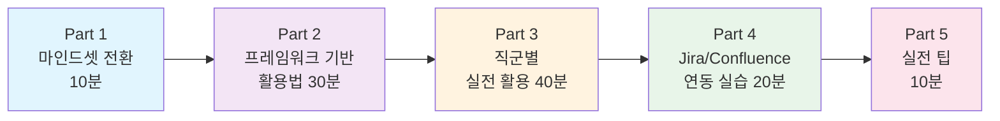

---

## Part 1: 마인드셋 전환

### 잘못된 접근 vs 올바른 접근

**잘못된 접근**
```
"AI야, 뭐 도와줄 거 있어?" → 막막함
```

**올바른 접근**
```
"내 업무 프로세스의 이 단계에서 AI를 쓰자" → 명확함
```

### 핵심 원칙

AI는 **프로세스의 각 단계를 가속화**하는 도구입니다.

- AI가 생각을 대신하는 것이 아님
- 당신의 생각을 더 빠르게 정리해주는 것
- 프레임워크를 알면 AI 활용이 쉬워짐

---

## Part 2: 프레임워크 기반 활용법

### 2.1 PDCA 사이클에 AI 끼워넣기

| 단계 | 기존 방식 | AI 활용 방식 |
|------|----------|-------------|
| **Plan (계획)** | 혼자 조사, 계획 수립 | "이 문제에 대한 선행 사례 조사해줘", "계획서 초안 작성해줘" |
| **Do (실행)** | 직접 실행 | "이 데이터 정리해줘", "이메일 초안 작성해줘" |
| **Check (검토)** | 수동 검토 | "이 결과물 검토해줘", "문제점 찾아줘" |
| **Act (조치)** | 개선안 도출 | "개선 방안 3가지 제안해줘", "다음 단계 정리해줘" |

**PDCA + AI 활용 사이클**

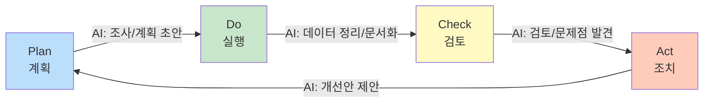

#### 실습 예시

```
"우리 팀 주간회의 효율화를 위한 PDCA 사이클을 만들어줘.
Plan: 현재 문제점 분석
Do: 개선안 실행
Check: 효과 측정 방법
Act: 표준화 방안"
```

---

### 2.2 컨설팅 프레임워크 활용

**프레임워크 활용 프로세스**

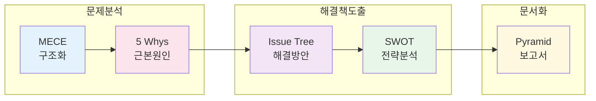

#### MECE로 문제 구조화

**프롬프트 예시**:
```
"고객 이탈률이 높은 원인을 MECE하게 분류해줘"
```

**결과 예시**:
```
├── 제품/서비스 요인
│   ├── 품질 문제
│   └── 가격 문제
├── 고객 서비스 요인
│   ├── 응대 속도
│   └── 문제 해결력
└── 경쟁 요인
    ├── 대체재
    └── 경쟁사 프로모션
```

#### Issue Tree로 해결책 도출

```
"매출 10% 증가를 위한 방안을 Issue Tree로 정리해줘"
```

#### Pyramid Principle로 보고서 작성

```
"이 분석 결과를 피라미드 구조로 정리해줘.
결론 먼저, 그 다음 3가지 근거, 각 근거별 세부 데이터"
```

#### 5 Whys로 근본 원인 분석

```
"프로젝트 지연의 근본 원인을 5 Whys로 분석해줘"
```

#### SWOT 분석

```
"우리 회사의 신규 서비스 런칭에 대한 SWOT 분석해줘"
```

---

## Part 3: 직군별 실전 활용

### 3.1 기획/PM

**상황**: 신규 기능 기획서 작성

**기획/PM 워크플로우**

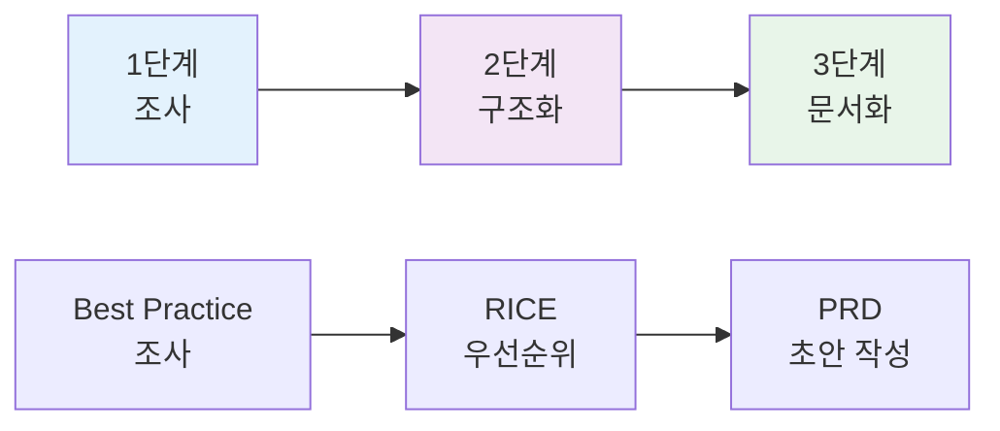

```
1단계 - 조사:
"B2B SaaS에서 사용자 온보딩 best practice 조사해줘"

2단계 - 구조화:
"조사 결과를 바탕으로 우리 제품에 적용할 온보딩 기능을
RICE 스코어링으로 우선순위 정해줘"

3단계 - 문서화:
"1순위 기능의 PRD(제품 요구사항 문서) 초안 작성해줘.
배경, 목표, 사용자 스토리, 성공 지표 포함"
```

#### 추가 활용 사례

- 경쟁사 분석 보고서
- 사용자 인터뷰 질문지 작성
- 릴리즈 노트 초안
- 스프린트 회고 정리

---

### 3.2 마케팅

**상황**: 캠페인 기획

**마케팅 캠페인 워크플로우**

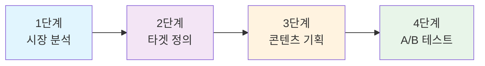

```
1단계 - 시장 분석:
"2024년 한국 화장품 시장 트렌드를 PESTEL로 분석해줘"

2단계 - 타겟 정의:
"MZ세대 화장품 구매 행동을 페르소나로 만들어줘"

3단계 - 콘텐츠 기획:
"이 페르소나 대상 인스타그램 캠페인 콘텐츠 아이디어 10개"

4단계 - A/B 테스트 설계:
"CTA 버튼 색상 A/B 테스트 설계해줘. 가설, 측정 지표, 샘플 사이즈"
```

#### 추가 활용 사례

- SNS 콘텐츠 캘린더 작성
- 광고 카피 변형 생성
- 캠페인 성과 분석 보고서
- 경쟁사 마케팅 전략 분석

---

### 3.3 영업/BD

**상황**: 제안서 작성

**영업/BD 제안서 작성 워크플로우**

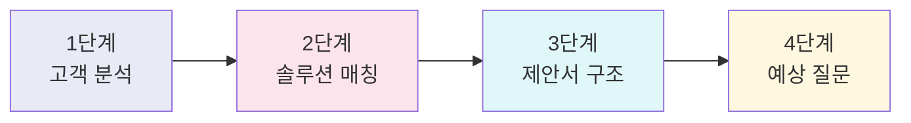

```
1단계 - 고객 분석:
"[회사명]의 최근 뉴스, IR 자료 분석해서 pain point 파악해줘"

2단계 - 솔루션 매칭:
"파악된 pain point와 우리 솔루션의 fit을 정리해줘"

3단계 - 제안서 구조:
"피라미드 구조로 제안서 아웃라인 잡아줘.
핵심 메시지: '운영 비용 30% 절감'"

4단계 - 예상 질문:
"이 제안에 대해 고객이 할 수 있는 반론 5가지와 대응 논리"
```

#### 추가 활용 사례

- 콜드 이메일 템플릿 작성
- 미팅 후 팔로업 이메일
- 계약 조건 협상 시나리오
- 파이프라인 분석 및 예측

---

### 3.4 HR/운영

**상황**: 성과 평가 체계 개선

**HR/운영 개선 워크플로우**

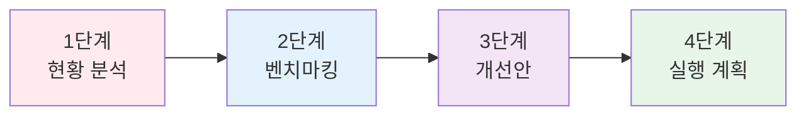

```
1단계 - 현황 분석:
"현재 성과 평가 체계의 문제점을 5 Whys로 분석해줘"

2단계 - 벤치마킹:
"글로벌 IT 기업의 성과 평가 트렌드 조사해줘"

3단계 - 개선안:
"우리 회사에 적용할 수 있는 개선안을
장단점, 구현 난이도와 함께 3가지 제안해줘"

4단계 - 실행 계획:
"1순위 개선안의 A3 보고서 형식으로 실행 계획 만들어줘"
```

#### 추가 활용 사례

- 채용 공고 작성
- 면접 질문지 구성
- 온보딩 체크리스트
- 사내 정책 문서 초안

---

### 3.5 재무/회계

**상황**: 예산 계획 수립

```
1단계 - 데이터 정리:
"이 지출 데이터를 카테고리별로 분류하고 트렌드 분석해줘"

2단계 - 예측:
"과거 3년 데이터 기반으로 내년 예산 예측해줘"

3단계 - 보고서:
"경영진 보고용 예산 요약 보고서를 피라미드 구조로 작성해줘"
```

---

### 3.6 디자인

**상황**: UX 리서치

```
1단계 - 리서치 설계:
"사용자 인터뷰 질문지 작성해줘. 목표: 결제 플로우 개선점 발견"

2단계 - 데이터 분석:
"인터뷰 결과를 affinity mapping으로 그룹화해줘"

3단계 - 인사이트 도출:
"분석 결과에서 핵심 인사이트 5가지와 개선 방향 제안해줘"
```

---

## Part 4: Jira/Confluence 연동 실습

### AI-driven-work 프로젝트 활용

**Jira/Confluence 연동 프로세스 개요**

```mermaid
flowchart LR
    subgraph 일일루틴
        A[Claude Code<br/>실행] --> B[/daily-standup]
        B --> C[이슈 할당<br/>/assign-me]
    end

    subgraph 주간루틴
        D[/weekly-report] --> E[Confluence<br/>자동 저장]
    end

    subgraph 문서화
        F[Slack 스레드] --> G[/save-slack-thread]
        G --> H[Confluence<br/>페이지]
    end

    style A fill:#e3f2fd
    style B fill:#f3e5f5
    style C fill:#e8f5e9
    style D fill:#fff3e0
    style E fill:#e8f5e9
    style F fill:#fce4ec
    style G fill:#f3e5f5
    style H fill:#e8f5e9
```

#### 일일 루틴

```bash
# 아침에 Claude Code 실행
claude

# 오늘 할 일 파악
> /daily-standup

# 결과:
# - 미할당 이슈 목록
# - 내가 담당한 이슈 현황
# - 오늘 마감인 이슈

# 미할당 이슈 중 내가 할 수 있는 것 선택
> /assign-me PROJ-123
```

#### 주간 보고 자동화

```bash
# 금요일 오후
> /weekly-report

# 결과:
# - 이번 주 완료한 이슈
# - 진행 중인 이슈
# - 다음 주 계획
# - Confluence에 자동 저장
```

#### Slack 대화 → 문서화

```bash
# 중요한 의사결정 스레드 발견
> /save-slack-thread

# 결과:
# - Slack 스레드 내용 추출
# - Confluence 페이지로 자동 변환
# - 의사결정 사항 정리
```

#### Jira 이슈 생성

```bash
# 새로운 업무 발생 시
> "마케팅 캠페인 랜딩페이지 제작 Task를 Jira에 만들어줘.
   담당자: 나
   마감일: 다음 주 금요일
   설명: 신규 프로모션용 랜딩페이지"
```

---

## Part 5: 실전 팁

### 좋은 프롬프트의 3요소

**프롬프트 구성 요소**

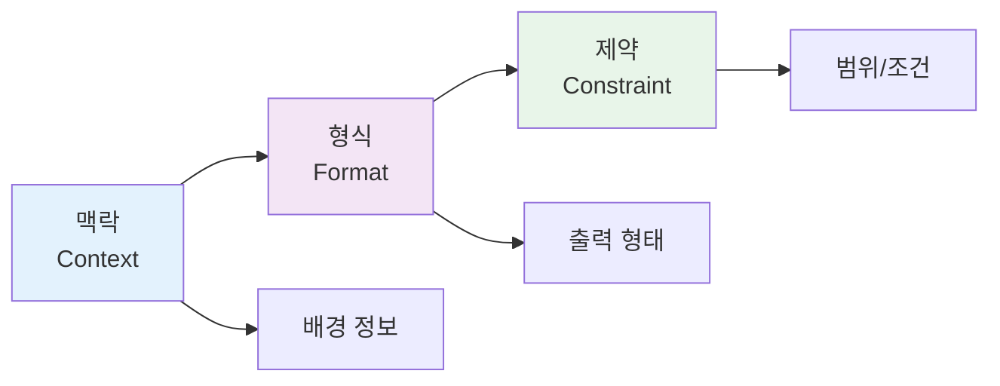

1. **맥락(Context)**: 배경 정보 제공
   - "우리는 B2B SaaS 회사이고..."
   - "50인 규모의 스타트업에서..."

2. **형식(Format)**: 원하는 출력 형태 지정
   - "표 형식으로"
   - "MECE하게"
   - "A3 보고서로"
   - "bullet point로"

3. **제약(Constraint)**: 범위와 조건 설정
   - "3가지로"
   - "500자 이내로"
   - "실행 가능한 것만"
   - "예산 1000만원 이내로"

#### 예시

```
❌ 나쁜 프롬프트:
"마케팅 전략 짜줘"

✅ 좋은 프롬프트:
"우리는 B2B HR SaaS 스타트업이야 (맥락).
Q1 마케팅 전략을 MECE하게 분류해서 표 형식으로 정리해줘 (형식).
예산 5000만원 이내, 실행 가능한 것만 3가지로 (제약)."
```

---

### 반복 사용하는 프롬프트는 Slash Command로 저장

#### 예시: 시장 분석 커맨드

파일 경로: `.claude/commands/market-analysis.md`

```markdown
$ARGUMENTS 시장에 대해 다음을 분석해줘:

1. PESTEL 분석
   - Political, Economic, Social, Technological, Environmental, Legal

2. Porter's 5 Forces
   - 신규 진입자, 공급자, 구매자, 대체재, 산업 내 경쟁

3. 주요 플레이어 3개사 비교
   - 시장 점유율, 강점, 약점

4. 시사점 및 기회 요인
   - 우리 회사에 적용 가능한 전략적 시사점
```

**사용 방법**:
```bash
> /market-analysis 전기차 충전 인프라
> /market-analysis 국내 펫푸드
```

#### 예시: 보고서 작성 커맨드

파일 경로: `.claude/commands/pyramid-report.md`

```markdown
다음 내용을 피라미드 구조 보고서로 작성해줘:

## 입력 내용
$ARGUMENTS

## 출력 형식
1. 핵심 메시지 (한 문장)
2. 3가지 지원 근거
3. 각 근거별 세부 데이터/사례
4. 결론 및 제안
```

---

### 체인 프롬프트 활용

복잡한 문제는 단계별로 나눠서 질문합니다.

**체인 프롬프트 흐름**

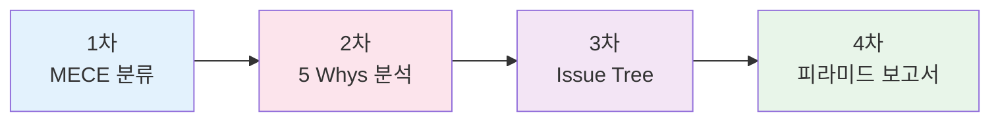

```
1차: "이 문제를 MECE하게 분류해줘"
     ↓
2차: "각 분류별 근본 원인을 5 Whys로 분석해줘"
     ↓
3차: "가장 중요한 원인에 대한 해결책을 Issue Tree로"
     ↓
4차: "최종 결과를 피라미드 구조 보고서로"
```

#### 실전 예시: 고객 이탈 문제 해결

```
1차 프롬프트:
"우리 서비스의 고객 이탈 원인을 MECE하게 분류해줘"

2차 프롬프트:
"분류 중 '고객 서비스 요인'에 대해 5 Whys로 근본 원인 분석해줘"

3차 프롬프트:
"근본 원인 '응대 시간 지연'을 해결하기 위한 방안을 Issue Tree로 정리해줘"

4차 프롬프트:
"최종 개선안을 경영진 보고용 피라미드 구조 보고서로 작성해줘"
```

---

### 검토 및 개선 요청

AI의 첫 번째 답변을 그대로 사용하지 말고, 검토 요청을 합니다.

```
"이 내용에서 논리적 허점이나 누락된 부분 찾아줘"

"더 구체적인 숫자나 사례를 추가해줘"

"반대 의견이나 리스크도 포함해줘"

"비전문가도 이해할 수 있게 쉽게 다시 써줘"
```

---

## 교육 후 제공물

### 1. 프레임워크별 프롬프트 템플릿 모음

| 프레임워크 | 프롬프트 템플릿 |
|-----------|----------------|
| PDCA | "[주제]에 대한 PDCA 사이클을 만들어줘. 각 단계별 구체적 행동 포함" |
| MECE | "[문제]의 원인을 MECE하게 분류해줘" |
| Issue Tree | "[목표]를 달성하기 위한 방안을 Issue Tree로 정리해줘" |
| 5 Whys | "[문제]의 근본 원인을 5 Whys로 분석해줘" |
| Pyramid | "[내용]을 피라미드 구조로 정리해줘. 결론 먼저, 근거 3가지" |
| SWOT | "[주제]에 대한 SWOT 분석해줘" |
| PESTEL | "[시장/산업]을 PESTEL로 분석해줘" |

### 2. 직군별 Use Case 예시집

- 기획/PM 10가지 활용 사례
- 마케팅 10가지 활용 사례
- 영업/BD 10가지 활용 사례
- HR/운영 10가지 활용 사례
- 재무/회계 10가지 활용 사례
- 디자인 10가지 활용 사례

### 3. Slash Command 커스터마이징 가이드

- 나만의 Slash Command 만드는 법
- 팀 공용 Command 공유 방법
- 자주 쓰는 프롬프트 템플릿화

### 4. 주간 AI 활용 챌린지

**주간 챌린지 진행 흐름**

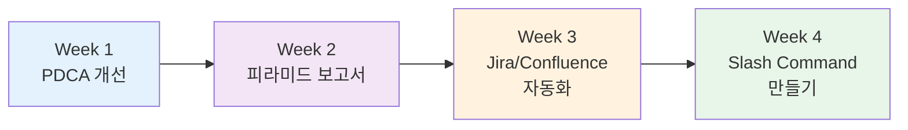

**Week 1**: PDCA로 업무 하나 개선하기
**Week 2**: 보고서를 피라미드 구조로 작성하기
**Week 3**: Jira/Confluence 연동으로 주간보고 자동화
**Week 4**: 나만의 Slash Command 3개 만들기

---

## 교육 효과 측정

| 지표 | 측정 방법 | 목표 |
|------|----------|------|
| **업무 시간 단축** | 보고서 작성 시간 before/after | 50% 감소 |
| **문서화 품질** | Confluence 페이지 완성도 평가 | 평균 4점/5점 |
| **활용 빈도** | Claude Code 주간 사용 횟수 | 주 10회 이상 |
| **만족도** | 교육 후 설문 (1-5점) | 평균 4점 이상 |
| **자동화 구현** | Slash Command 생성 개수 | 인당 3개 이상 |

---

## 핵심 요약

### 비개발자가 AI를 잘 쓰려면

**AI 활용 성숙도 단계**

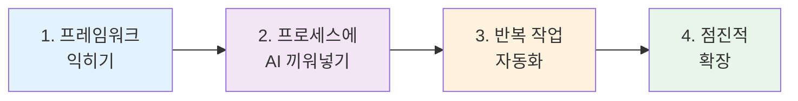

1. **프레임워크를 먼저 익혀라**
   - PDCA, MECE, Issue Tree, Pyramid Principle
   - 프레임워크를 알면 무엇을 물어볼지 명확해짐

2. **프로세스에 AI를 끼워넣어라**
   - 조사 → 구조화 → 작성 → 검토
   - 각 단계에서 AI가 가속화

3. **반복 작업은 자동화하라**
   - Slash Command 활용
   - 프롬프트 템플릿화

4. **작은 것부터 시작하라**
   - 이메일 초안 → 보고서 → 기획서
   - 점진적으로 복잡한 업무로 확장

---

## 마무리

> **"AI는 당신의 생각을 대신하지 않는다. 당신의 생각을 더 빠르게 정리해준다."**

AI Agent는 도구입니다. 도구를 잘 쓰려면:
- 무엇을 만들지 알아야 하고 (업무 목표)
- 어떻게 만들지 알아야 합니다 (프레임워크)

프레임워크를 익히면 AI 활용이 자연스러워집니다.

---

## 참고 자료

- [문제 해결 사이클 및 컨설팅 프레임워크](problem-solving-frameworks.md)
- [직군별 및 보편적 업무 프로세스](universal-work-processes.md)
- [Claude Code 사용법](claude-code-guide.md)
- [Jira 운영 규칙](jira-guidelines.md)

---

**최종 업데이트**: 2025년 11월 19일
**버전**: 1.0
